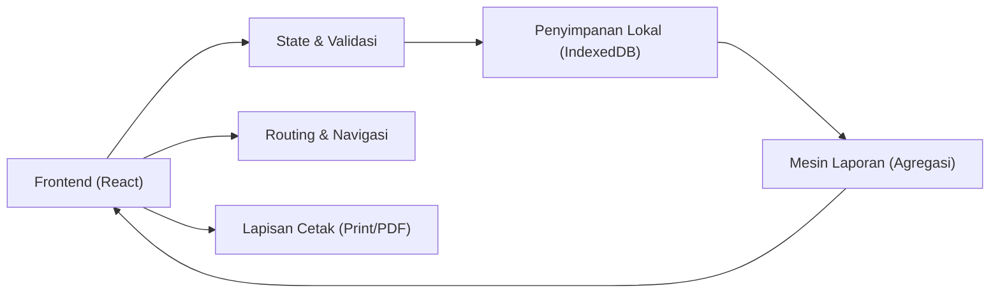
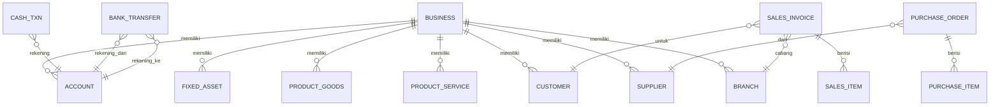

## 1. Desain Arsitektur
Target utama: aplikasi web responsif (desktop-first) dengan penyimpanan lokal persisten, mampu melakukan CRUD master data, input transaksi, perhitungan ringkasan, serta menghasilkan laporan dan halaman cetak.

## 2. Deskripsi Teknologi
- Frontend: React@18 + TypeScript + Vite
- Styling: tailwindcss@3 (tema dark + token warna via CSS variables)
- Routing: react-router-dom
- Penyimpanan Lokal: IndexedDB melalui wrapper (pilih salah satu saat implementasi: localforage atau Dexie)
- Visualisasi: library chart ringan (mis. recharts) atau chart berbasis SVG internal
- Ekspor/Cetak: CSS print styles + window.print() (PDF via “Save as PDF” dari browser)

## 3. Definisi Rute
| Route | Tujuan |
|---|---|
| / | Redirect ke /dashboard |
| /dashboard | Ringkasan keuangan + grafik |
| /setup/usaha | Data usaha |
| /setup/pelanggan | Daftar pelanggan |
| /setup/supplier | Daftar supplier |
| /setup/nomor-dokumen | Pengaturan nomor dokumen |
| /setup/akun | Daftar akun keuangan (COA) |
| /setup/aset-tetap | Daftar aset tetap |
| /setup/pembayaran-dimuka | Pembayaran di muka |
| /setup/cabang | Daftar toko/cabang |
| /setup/jasa | Daftar produk jasa |
| /setup/barang | Daftar produk dagang |
| /transaksi/penjualan | Input & daftar penjualan |
| /transaksi/pembelian | Input & daftar pembelian |
| /transaksi/kas-bank | Penerimaan & pengeluaran |
| /transaksi/mutasi | Mutasi rekening |
| /transaksi/penyusutan | Proses penyusutan |
| /transaksi/konsinyasi | Titip jual & konsinyasi |
| /transaksi/tanda-terima | Tanda terima |
| /cetak/invoice/:id | Cetak invoice |
| /cetak/po/:id | Cetak purchase order |
| /cetak/kwitansi/:id | Cetak kwitansi |
| /laporan/laba-rugi | Laba rugi (kotor/bulanan/umum) |
| /laporan/neraca | Neraca |
| /laporan/arus-kas | Arus kas (bulanan/umum) |
| /laporan/ekuitas | Ekuitas |
| /laporan/aset | Laporan aset |
| /laporan/pajak-umkm | Pajak UMKM |
| /laporan/transaksi | Laporan transaksi |
| /laporan/arus-rekening | Arus rekening |
| /laporan/piutang | Piutang pelanggan |
| /laporan/utang | Utang supplier |
| /laporan/invoice | Daftar invoice |
| /laporan/purchase-order | Daftar purchase order |
| /laporan-cabang/harian | Penjualan cabang harian |
| /laporan-cabang/mingguan | Penjualan cabang mingguan |
| /laporan-cabang/bulanan | Penjualan cabang bulanan |
| /laporan-produk/harian | Penjualan produk harian |
| /laporan-produk/mingguan | Penjualan produk mingguan |
| /laporan-produk/bulanan | Penjualan produk bulanan |
| /laporan-persediaan/stok-pembelian | Stok pembelian |
| /laporan-persediaan/stok-konsinyasi | Stok titip jual |
| /info/cara-penggunaan | Cara penggunaan |
| /info/lisensi | Lisensi |
| /info/tentang | Tentang kami |

## 4. Definisi API (Tidak Ada Backend pada Versi Awal)
Versi awal berjalan sepenuhnya di browser. Semua operasi CRUD dan laporan membaca dari penyimpanan lokal. Struktur kode memisahkan “repository” agar backend bisa ditambahkan nanti.

## 5. Model Data

### 5.1 Definisi Model (ERD Ringkas)

### 5.2 Skema Penyimpanan (Konsep)
Penyimpanan IndexedDB menyimpan koleksi utama:
- business (1 record)
- branches, customers, suppliers
- accounts, documentNumbering
- productsServices, productsGoods
- fixedAssets, advances
- transactions: salesInvoices, purchaseOrders, cashTxns, bankTransfers, depreciations, consignments, receipts
- journalEntries (hasil posting otomatis dari transaksi)

Kunci desain:
- Semua record memakai id (UUID) + createdAt/updatedAt.
- Transaksi memiliki status (draft/posted/void) untuk keamanan akuntansi.
- Jurnal dipisah dari transaksi agar laporan lebih cepat.

## 6. Mesin Laporan (Prinsip Perhitungan)
- Dashboard dan laporan membaca dari journalEntries + transaksi yang sudah posted.
- Laba Rugi: agregasi akun pendapatan & beban per periode; HPP dihitung dari item barang (jika ada) + aturan stok sederhana.
- Neraca: saldo akun aset/kewajiban/ekuitas (saldo awal + mutasi jurnal).
- Arus Kas: ambil transaksi kas/bank (cashTxns + bankTransfers) dan kelompokkan kategori.
- Piutang/Utang: saldo invoice/PO yang belum lunas (dari transaksi + pembayaran).

Catatan: aturan stok & HPP dibuat sederhana dan konsisten untuk kebutuhan salon; dapat ditingkatkan menjadi FIFO/average pada iterasi lanjut.
