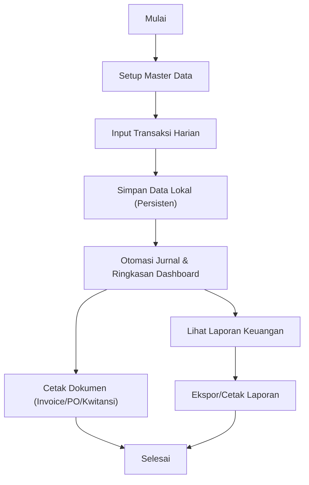

## 1. Gambaran Produk
Andreano Hair Salon adalah aplikasi web untuk akuntansi, manajemen usaha, dan laporan keuangan salon dalam satu dashboard gelap yang rapi, responsif, dan menyimpan data secara lokal agar tidak hilang saat tab ditutup.
- Menyederhanakan pencatatan transaksi harian (penjualan, pembelian, kas/bank) dan otomatis menghasilkan laporan (laba rugi, neraca, arus kas).
- Target pengguna: pemilik salon, admin keuangan, kasir/cabang yang melakukan input transaksi.

## 2. Fitur Inti

### 2.1 Peran Pengguna (opsional untuk versi awal)
| Peran | Cara Masuk | Hak Akses Inti |
|------|------------|----------------|
| Pemilik/Administrator | Tanpa login (mode offline) | Kelola semua master data, transaksi, dan semua laporan |
| Staff Cabang | Tanpa login (mode offline) | Input transaksi cabang, lihat laporan cabang/produk |

Catatan: versi awal fokus single-tenant offline tanpa autentikasi; struktur UI disiapkan agar mudah ditambahkan autentikasi di iterasi berikutnya.

### 2.2 Modul Fitur (Halaman Esensial)
1. **Dashboard (Analisa)**: ringkasan finansial utama, grafik tren, quick actions menuju transaksi.
2. **Setup (Master Data)**: data usaha, pelanggan, supplier, akun, produk jasa/dagang, aset tetap, cabang, nomor dokumen, pembayaran di muka.
3. **Transaksi**: penjualan, pembelian, penerimaan & pengeluaran, mutasi rekening, penyusutan, titip jual/konsinyasi, tanda terima.
4. **Cetak**: invoice, purchase order, kwitansi (preview + ekspor/print).
5. **Laporan Keuangan**: laba rugi, neraca, arus kas, ekuitas, aset, pajak UMKM, daftar transaksi, arus rekening, piutang, utang, daftar invoice, daftar PO.
6. **Laporan Cabang**: penjualan harian/mingguan/bulanan per cabang.
7. **Laporan Produk**: penjualan harian/mingguan/bulanan per produk (jasa/dagang).
8. **Laporan Persediaan**: stok pembelian, stok titip jual.
9. **Informasi**: cara penggunaan, lisensi, tentang kami.

### 2.3 Detail Halaman (Ringkas)
| Nama Halaman | Modul | Deskripsi Fitur |
|---|---|---|
| Dashboard | Kartu Ringkasan | Menampilkan kas awal/akhir, utang/piutang, pendapatan, HPP, pengeluaran, laba/rugi bersih dengan highlight warna (biru/merah) |
| Dashboard | Grafik | Grafik pendapatan vs pengeluaran, tren laba rugi (harian/bulanan) |
| Dashboard | Quick Actions | Tombol cepat: tambah penjualan, tambah pembelian, tambah penerimaan/pengeluaran |
| Setup - Data Usaha | Profil Usaha | Nama usaha, NPWP (opsional), alamat, kontak, pajak UMKM (%) |
| Setup - Cabang | Daftar Cabang | CRUD cabang/toko, status aktif, kode cabang |
| Setup - Akun Keuangan | COA | CRUD akun (kode, nama, tipe: aset/kewajiban/ekuitas/pendapatan/beban), saldo awal |
| Setup - Nomor Dokumen | Penomoran | Pola nomor untuk invoice/PO/kwitansi/tanda terima, reset periodik |
| Setup - Pelanggan | Master Pelanggan | CRUD pelanggan, kontak, termin, batas kredit |
| Setup - Supplier | Master Supplier | CRUD supplier, kontak, termin |
| Setup - Produk Jasa | Master Jasa | CRUD jasa, harga default, kategori, komisi (opsional) |
| Setup - Produk Dagang | Master Barang | CRUD barang, SKU, satuan, harga beli/jual, stok minimum |
| Setup - Aset Tetap | Master Aset | CRUD aset, nilai perolehan, umur manfaat, metode penyusutan, akun terkait |
| Setup - Pembayaran Di Muka | Uang Muka | Pencatatan uang muka pelanggan/supplier dan pemakaian saat transaksi |
| Transaksi - Penjualan | Form Penjualan | Header (tgl, cabang, pelanggan, metode bayar, rekening), item jasa/barang, diskon/pajak, otomatis jurnal |
| Transaksi - Pembelian | Form Pembelian | Header (tgl, supplier, rekening), item barang, biaya tambahan, otomatis jurnal + stok pembelian |
| Transaksi - Penerimaan & Pengeluaran | Kas/Bank | Input kas masuk/keluar, kategori akun, lampiran (opsional), jurnal |
| Transaksi - Mutasi Rekening | Transfer | Transfer antar rekening kas/bank, otomatis jurnal debit/kredit |
| Transaksi - Penyusutan | Generate Penyusutan | Proses periodik, membuat jurnal penyusutan dari master aset |
| Transaksi - Titip Jual & Konsinyasi | Titip Jual | Pencatatan stok titip, penjualan titip, dan rekonsiliasi |
| Transaksi - Tanda Terima | Bukti | Pencatatan tanda terima sederhana (uang/barang/dokumen) + cetak |
| Cetak - Invoice | Preview + Print | Template invoice dari transaksi penjualan, nomor otomatis, cetak ke printer/PDF |
| Cetak - PO | Preview + Print | Template purchase order dari transaksi pembelian/permintaan pembelian |
| Cetak - Kwitansi | Preview + Print | Template kwitansi penerimaan pembayaran |
| Laporan - Laba Rugi | Filter Periode | Laba rugi kotor, bulanan, umum; ekspor/print |
| Laporan - Neraca | Periode | Neraca aset/kewajiban/ekuitas; konsisten dengan COA |
| Laporan - Arus Kas | Bulanan & Umum | Direct method sederhana dari transaksi kas/bank |
| Laporan - Pajak UMKM | Periode | Hitung pajak final UMKM berdasarkan omzet (parameter % dari setup) |
| Laporan - Piutang/Utang | Aging (opsional) | Daftar piutang pelanggan dan utang supplier dari invoice/PO |
| Laporan Cabang | Rekap Cabang | Penjualan harian/mingguan/bulanan per cabang + tren |
| Laporan Produk | Rekap Produk | Penjualan harian/mingguan/bulanan per produk + top produk |
| Laporan Persediaan | Stok | Stok pembelian & stok titip jual, mutasi stok sederhana |
| Informasi | Cara Penggunaan | Panduan langkah demi langkah: setup → transaksi → laporan |
| Informasi | Lisensi | Informasi lisensi aplikasi (placeholder sesuai kebutuhan) |
| Informasi | Tentang Kami | Profil Andreano Hair Salon + kontak |

## 3. Proses Inti
Alur penggunaan utama:
1) Pengguna mengisi Setup (data usaha, akun, cabang, produk, pelanggan/supplier).
2) Pengguna memasukkan transaksi harian (penjualan/pembelian/kas/bank).
3) Sistem menyimpan data secara lokal dan membentuk jurnal otomatis.
4) Pengguna membuka laporan untuk melihat ringkasan dan mencetak dokumen.

## 4. Desain Antarmuka
### 4.1 Gaya Desain
- Tema: latar belakang gelap (charcoal/near-black), teks terang.
- Navigasi: sidebar/topbar dengan aksen hijau tua untuk menu aktif dan tombol utama.
- Highlight: merah untuk status penting/negatif (mis. utang, pengeluaran, rugi), biru untuk informasi/positif tertentu (mis. piutang, kas).
- Tipografi: judul tegas, isi mudah dibaca, kontras tinggi, jarak antar elemen rapih.
- Layout: desktop-first dengan sidebar menu multi-level; mobile memakai drawer.
- Ikon: ikon garis sederhana (monokrom) agar bersih.

### 4.2 Ringkasan Halaman (UI)
| Nama Halaman | Modul | Elemen UI |
|---|---|---|
| Dashboard | Ringkasan | Grid kartu KPI, indikator warna (hijau/biru/merah), tombol cepat |
| Setup | List + Form | Tabel data, pencarian, filter, form modal/drawer, validasi input |
| Transaksi | Form | Header transaksi, tabel item, kalkulasi otomatis, preview jurnal |
| Laporan | Filter + Output | Filter periode/cabang/produk, tabel laporan, chart sederhana, tombol print/export |
| Cetak | Template | Preview dokumen, pengaturan ukuran, print-friendly styles |

### 4.3 Responsif
- Desktop: sidebar permanen, konten lebar, tabel dengan sticky header.
- Mobile: sidebar menjadi drawer, tabel berubah menjadi kartu/stack, tombol aksi mengambang (opsional).
- Aksesibilitas: kontras warna memadai, fokus keyboard jelas, label form eksplisit.
